


  


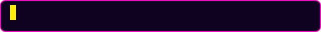

- 👩‍💻 **Name:** Sara Oussoussou
- 🎓 **Role:** AI Engineering Student
- 🎯 **Focus:** Machine Learning, Computer Vision, NLP
- 🔭 **Building:** AI Trading Journal and AI Document Assistant
- 🌱 **Learning:** Data Analysis, Algorithms, AI Applications
- 🚀 **Goal:** Build real-world AI products

 

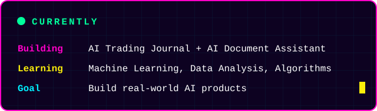
  

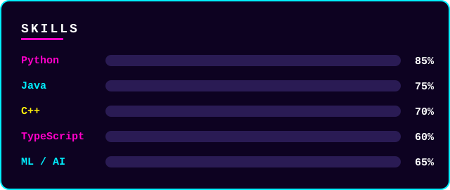

  

  

<a href="https://github.com/22407756/ai-trading-journal-APP">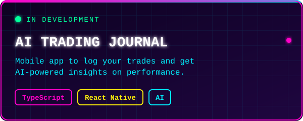</a>
<a href="https://github.com/22407756/AI-Document-Assistant"></a>

<a href="https://github.com/22407756/emotion-detection-app">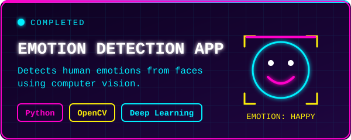</a>
<a href="https://github.com/22407756/PodcastScheduler">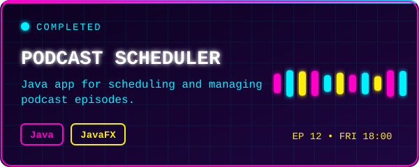</a>

<b>📂 More projects (click to expand)</b>

 

- 🎓 [Student Management System](https://github.com/22407756/student-management-system-cpp): console app in C++
- 🍋 [Little Lemon Project](https://github.com/22407756/littlelemon-project): Python project

| 🌱 LEARNING | 🔨 BUILDING | 🚀 GOAL |
|:---:|:---:|:---:|
| Machine Learning | AI Trading Journal | AI Engineer |
| Data Analysis | AI Document Assistant | Real-world AI products |
| Algorithms | Computer Vision apps | Open-source contributions |

 

  

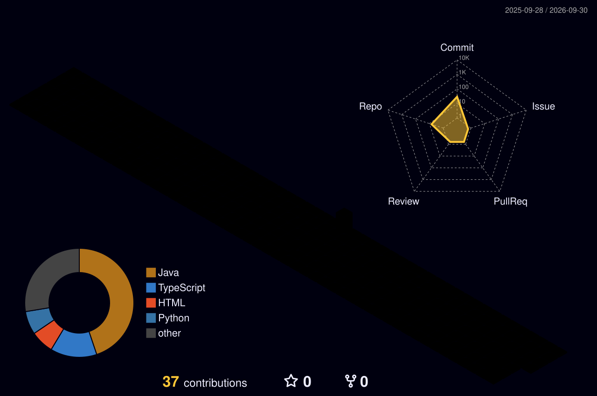

<a href="https://www.linkedin.com/in/sara-oussoussou">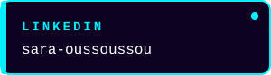</a>
<a href="mailto:saraoussoussou66@gmail.com">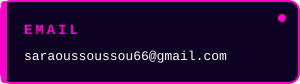</a>
<a href="https://github.com/22407756">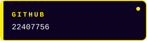</a>

  

### 💜 Thanks for visiting my profile!

